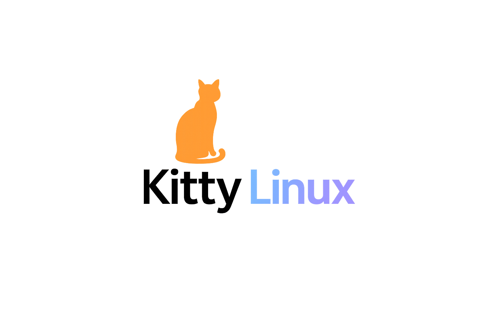

<!DOCTYPE html>
<html lang="en">
<head>
    <meta charset="UTF-8">
    <meta name="viewport" content="width=device-width, initial-scale=1.0">
    <title>Kitty Linux - Official Site</title>
    
</head>
<body>

    

        <!-- 🎨 Centered Giant Logo & Headline -->
        

            
            <h1>Kitty Linux</h1>
            
The Purr-fect Lightweight Operating System 🐾

        

        

        <!-- 🚀 Key Features -->
        <h2 class="section-title">Key Features</h2>
        <ul>
            <li>🐱 <strong>Ultra-Lightweight Architecture:</strong> Blazing fast performance built directly onto optimized system frames, explicitly tuned like Puppy Linux.</li>
            <li>🦊 <strong>Firefox Pre-Loaded:</strong> Bundled natively right out of the box with highly targeted security and cat-themed browser presets.</li>
            <li>💻 <strong>Total Hardware Adaptability:</strong> Boots seamlessly inside minimal resource Virtual Machines or directly on physical desktop rigs.</li>
        </ul>

        

        <!-- 📥 Dynamic Download Layer -->
        

            <a href="#" class="btn-download">📥 Download Live Image (Coming Soon)</a>
        

        

        <!-- 📊 Hardware Specifications Grid Layout -->
        <h2 class="section-title">System Requirements</h2>
        

            

                
Memory Allocation

                
1 GB RAM Min

            

            

                
Storage Footprint

                
10 GB Drive Space

            

            

                
Processor Model

                
Intel / AMD 64-bit

            

        

    

</body>
</html>
